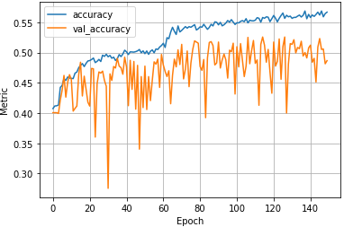
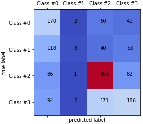

# Speech-Emotion-Recognition
A simple CNN-LSTM deep neural model using Tensorflow to classify emotions from speech dataset

## Table of contents
* Reading the 'train.json' file
    * Download link: www.kaggle.com/dataset/1ef5f65351c643f6d2fb0becc9993b73be3130090e234fa88f9307ef18b9de78
* Rescaling the features
* Creating train & validation data splits
* Defining the DNN model
* Model training
* Evaluating Results

## Overview
* Training Log,
    <p align="left">
* Results,
    <p align="left">
## Dependencies
Install dependencies using:
```bash
pip3 install -r requirements.txt 
```
	
## System Requirements
* The notebook is executed online on kaggle.com with a GPU accelerator.
* To run it locally on a PC, 16GB of RAM is needed.

## Challenge
* Boost the 'Validation Accuracy' by Model modification or Data Augmentation

## Contact
* email: navalekanishk@gmail.com